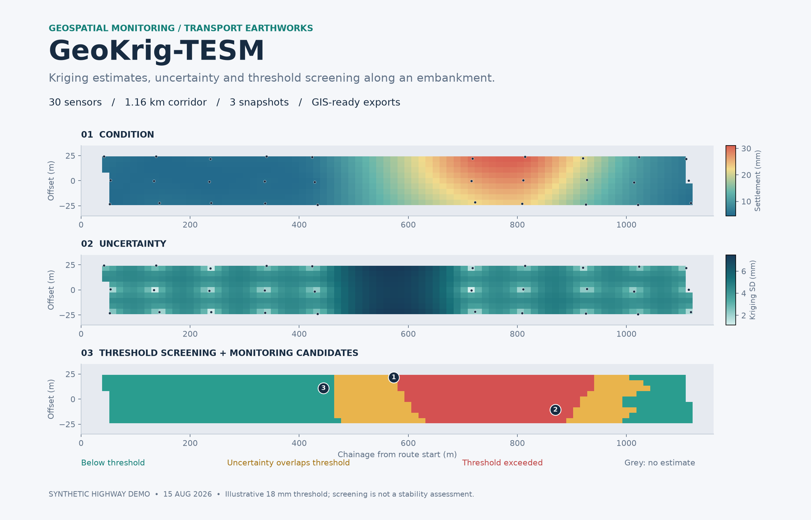

# GeoKrig-TESM

### Geospatial Kriging for Transport Earthwork Stability Monitoring

GeoKrig-TESM maps geotechnical monitoring data along highway and railway
embankments. It uses ordinary Kriging to estimate settlement, pore-water pressure
and volumetric water content between sensors. Maps show the estimates, their
interpolation uncertainty and areas exceeding a user-defined threshold.

[](https://github.com/YIXINLI921/GeoKrig-TESM/actions/workflows/tests.yml)




*Computed example outputs in corridor coordinates; lateral scale is exaggerated.
The application also displays these cells on an interactive geographic map.*

The examples use synthetic sensor readings and illustrative thresholds. The tool
supports inspection planning; it does not calculate slope stability or issue
safety warnings. Validation against field data is needed before engineering use.

**Location privacy:** the bundled examples use arbitrary local coordinates in
metres, with no geographic reference. Their maps contain no real basemap, place
names, roads or surrounding buildings. Local coordinates are also used in the
downloadable examples and analysis exports.

## Features

- Interpolation in route chainage and lateral offset, with an adjustable lateral
  distance multiplier.
- Separate maps of estimated measurements, kriging standard deviation and
  threshold exceedance.
- A support mask that leaves cells outside the sensor convex hull or beyond a
  selected sensor distance unestimated.
- Suggested monitoring locations ranked by uncertainty and spaced along the route.
- Leave-one-out validation with variogram refitting for each held-out sensor.
- GeoJSON and CSV exports for QGIS, ArcGIS and further analysis.

Kriging calculations use [PyKrige](https://github.com/GeoStat-Framework/PyKrige).

## Installation

Install Python **3.11 or 3.12**, then:

```bash
git clone https://github.com/YIXINLI921/GeoKrig-TESM.git
cd GeoKrig-TESM
python -m venv .venv
```

Activate the environment:

```bash
# macOS / Linux
source .venv/bin/activate
# Windows PowerShell: .venv\Scripts\Activate.ps1
```

Install and launch:

```bash
python -m pip install -r requirements.txt
python -m streamlit run app.py
```

Open the local address printed in the terminal. The highway demonstration runs
immediately. No database, GIS desktop installation or API key is required.
Private repositories require GitHub authentication when cloning.

## Example workflow

1. Start with **Synthetic demo → Highway → latest snapshot → Settlement**.
2. Switch **Condition / Uncertainty / Screening** and hover over map cells.
3. Select an earlier snapshot to compare its independently fitted spatial field.
4. In **Model checks**, run leave-one-out validation and inspect residuals.
5. In **Data & exports**, download the analysis ZIP. Demo grids use local JSON;
   geographic field uploads produce `grid.geojson` for QGIS.
6. Switch to **Railway**, or upload your own matching sensor and route files.

## Inputs

Use the [highway CSV](examples/highway_monitoring.csv) and
[local route JSON](examples/highway_route.json) as templates. A railway pair is
also included under `examples/`.

| CSV column | Meaning |
|---|---|
| `sensor_id` | Non-empty sensor identifier; unique within a snapshot |
| `timestamp` | ISO date or date-time; converted to UTC; one exact time defines a snapshot |
| `x_m`, `y_m` | Local coordinates in metres, used by the bundled examples |
| `longitude`, `latitude` | Alternative for geographic field data: WGS84 decimal degrees; do not combine with local columns |
| `settlement_mm` | Settlement in mm; positive downward |
| `pore_pressure_kpa` | Pore-water pressure in kPa; negative suction is allowed |
| `moisture_pct` | Volumetric water content in percent, from 0 to 100 |

All three measurement columns are required in this first version; only the
selected quantity is modelled. Missing, non-numeric and infinite values are
rejected. Asynchronous readings must be aligned to meaningful snapshots before
upload; the app does not silently average times or substitute missing values.

For local data, use a JSON object with `type: "LocalRoute"`,
`coordinate_system: "local_metres"` and `coordinates: [[x_m, y_m], ...]`.
For geographic data, the route is one GeoJSON `LineString` (a Feature or single-feature
FeatureCollection is also accepted). Sensor and route coordinate systems must match.
Use a gently curving, non-branching centreline
100 m–20 km long within UTM latitudes. The first vertex defines chainage zero.
Each snapshot needs 8–80 distinct sensor positions with lateral spread. Width is
the user-specified half-width, not an inferred or surveyed slope boundary.

## Outputs

| Download | Contents |
|---|---|
| `grid.geojson` | WGS84 cell polygons, estimates, SD, support flag and screening class |
| `grid_local.json` | Local-coordinate grid for the examples; replaces `grid.geojson` and is not WGS84 GeoJSON |
| `grid.csv` | Same grid as a table, including chainage, offset and nearest-sensor distance |
| `condition_map.html`, `uncertainty_map.html`, `screening_map.html` | Interactive maps |
| `monitoring_candidates.csv` | Up to three suggested sampling locations |
| `settings.json` | Variable, units, threshold, CRS, timestamp and model settings |
| `selected_observations.csv`, `route.geojson` or `route_local.json` | Inputs in the selected coordinate system |
| Validation CSV (separate button) | Observed, held-out prediction and residual for each sensor |

Null estimates mean **no spatial support**, not zero measurement. Local JSON uses
metres and deliberately has no EPSG code or global location. Its `LocalGrid` object
contains `cells` with local polygon coordinates and measurement properties.
For geographic uploads, GeoJSON is
EPSG:4326 with `[longitude, latitude]` coordinates; chainage and offset use metres.
Open `grid.geojson` as a vector layer in QGIS and style `prediction`, `std_dev` or
`screening`. GeoTIFF export is not implemented in v0.1.0.

## Method and interpretation

1. **Import:** sensor CSV and local route JSON or geographic route GeoJSON.
2. **Locate:** validate, project geographic inputs to local UTM if needed, and
   derive chainage and lateral offset.
3. **Estimate:** fit ordinary Kriging separately for each snapshot and variable.
4. **Screen:** map condition and conditional uncertainty; apply the support mask
   and selected threshold.
5. **Check:** refit leave-one-out models and inspect prediction residuals.
6. **Use:** export GIS layers and review candidate monitoring locations.

The distance multiplier scales lateral offsets before an automatically fitted
spherical, exponential or Gaussian variogram. It is an explicit modelling
assumption, not a measured anisotropy parameter. Ordinary Kriging assumes an
unknown constant mean in the analysed domain. Predictions are made at centres of
a 90 × 13 corridor grid; convex-hull and distance support checks use those centres.

Screening uses an **upper** threshold:

- Estimate ≥ threshold: **Threshold exceeded**.
- Estimate < threshold but estimate + 1.96 × SD ≥ threshold:
  **Uncertainty overlaps threshold**.
- Otherwise: **Below threshold**. Unsupported cells: **No estimate**.

The 1.96 multiplier is a Gaussian sensitivity convention, not a calibrated
confidence interval. Kriging SD is conditional on the fitted variogram and does
not include sensor error, parameter uncertainty, model bias or slope mechanics.
Default thresholds are illustrative. No combined multi-variable risk score,
probability of failure, factor of safety or automated safety alarm is calculated.

Candidate sites are ranked by SD **within the supported region**, at least 10 m
from an existing sensor and 120 m apart in chainage. They do not resolve
unsupported gaps; those require a separate survey plan. Hairpins, branching
routes and overlapping corridor buffers are outside scope. Predictions are not
clipped to physical limits; review implausible estimates and validation residuals.

## Reproducibility and tests

```bash
python -m pytest -q
python scripts/export_demo.py
```

The second command regenerates seeded examples and writes GIS maps and validation
tables to ignored `outputs/`. Both synthetic assets contain 30 sensors at three
snapshots. The tests cover exact interpolation, coordinate round trips, invalid
inputs, spatial support, thresholds, valid GeoJSON, validation arithmetic and app
interactions. GitHub Actions runs the suite on Python 3.11 and 3.12.

The README figure is generated from the example analysis results.
To regenerate it, install optional `matplotlib` and run `python scripts/render_preview.py`.

As a reproducibility check, the latest synthetic highway snapshot with default
settings gives settlement LOOCV RMSE **1.35 mm**, pore-pressure RMSE **2.27 kPa**
and water-content RMSE **0.94 percentage points**. These are synthetic results,
not evidence of field accuracy; numerical dependency versions can affect fitting.

## Hosting and privacy

The Python app needs a running server; GitHub Pages cannot execute it. Self-host
with the command above, or deploy `app.py` from this repository on a compatible
Streamlit host. A public hosted application is not currently available.

Uploads are processed on the host running the app, not deliberately written to
disk or cached across users. For private sensor data, use a trusted local host.
Interactive maps load Leaflet dependencies from CDNs. Demo maps use a local planar
coordinate system and never request map tiles. For geographic field uploads,
OpenStreetMap tiles are off by default and can be enabled explicitly. **Uploaded
geographic data is not anonymised:** its coordinates remain in tables and exports
even when tiles are off. Tile requests reveal viewport location. Respect the
[OpenStreetMap tile usage policy](https://operations.osmfoundation.org/policies/tiles/)
when hosting at scale.

## Development and history

The application begins with the **v0.1.0 implementation commit**. Earlier
`1.xx` entries are reconstructed archival placeholders, not evidence of earlier
feature releases. See `DEVELOPMENT_STATUS.md` for a resume checkpoint.

Current examples have no geographic reference. Older Git commits may still
contain the former geographically positioned synthetic examples; this update
does not erase historical versions.

Near-term extensions: GeoTIFF export, surveyed corridor polygons, calibrated
anisotropy, spatial block validation and optional temporal change maps.

**License:** MIT for the new application and synthetic examples. Historical
materials are outside this software license. Built with Streamlit, PyKrige,
NumPy/SciPy, pandas, pyproj, Shapely, Folium and Plotly.
